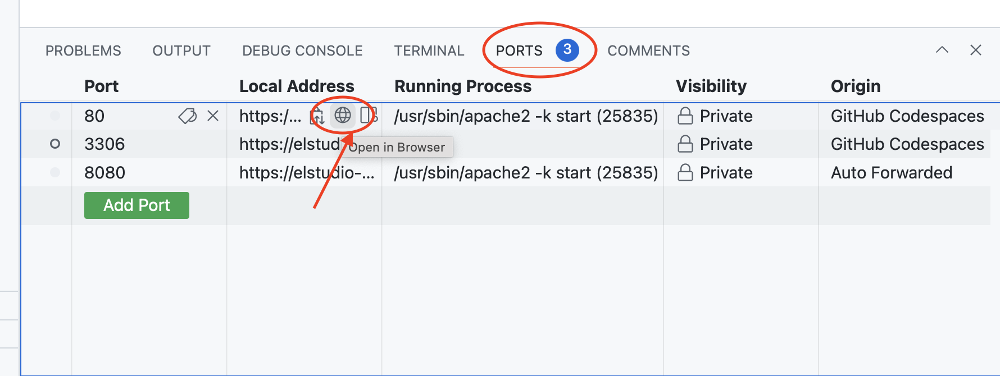
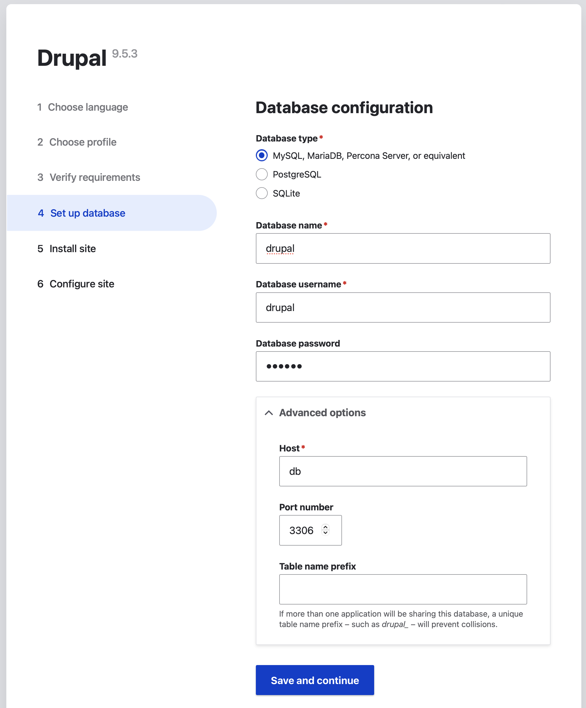

# Drupal 9 Codespaces example

Run Drupal 9 inside a Codespace for development purposes.

The `.devcontainer` folder contains configuration to spin up a Codespace running Apache, MySQL, PHP 8.1 and Composer. 

## How to use it

1. Start a Codespace, and from the terminal run `composer install` to download Drupal 9 and it's PHP dependencies. 
2. Click the `PORTS` tab, and hover over the local address line for port 80. Click the globe icon, which will open your Drupal website in a new browser tab

    

3. Follow the prompts to install your brand-new Drupal site
4. Database credentials can be found in `.devcontainer/devcontainer.env`. If you haven't changed this, the database server hostname is `db`. Database name, username and password are all `drupal`.

    

### Customization

Replace `composer.json` with your own site's version -- one that includes whatever modules or dependencies are needed for your site.

### Prior art

This example is based on the work of @alchatti. 

- [alchatti/drupal-devcontainer: VS Code development container environment for Drupal](https://github.com/alchatti/drupal-devcontainer). This setup includes some fancier stuff that we don't do here. It installs the Acquia tools, and it offers a couple of options for customizing the shell. 
